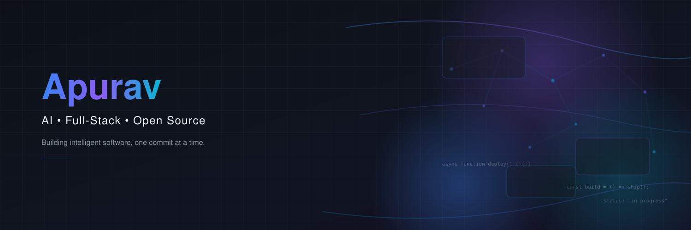

 

  

 

## About me

I'm a full-stack developer who enjoys building web products end to end and automating the boring parts of the stack along the way. I sit at the intersection of business and tech — I understand both how a product should work and why it should exist, which shapes how I build.

- 🔭 Currently building products with **Next.js** and **TypeScript**
- 🧠 Currently learning **RAG (Retrieval-Augmented Generation)** and **React Native**
- ⚙️ Deep into **workflow automation** with n8n
- 🏢 Co-building **[HermesWorkspace](https://hermesworkspace.com)**
- 💬 Ask me about Next.js, automation pipelines, or full-stack architecture

 

## Tech stack

**Languages**
 

**Frontend**
 

**Mobile**
 

**Backend**
 

**Databases**
 

**AI / automation**
 

**Tools**
 

 

## Featured projects

<table>
<tr>
<td width="50%" valign="top">

### 🍽️ Delulu-Cafe
Full-stack cafe management SaaS built for real-world restaurant operations.

**Stack:** Next.js · TypeScript · Prisma · shadcn/ui
**Status:** 🟡 In progress

[`View repo`](https://github.com/apurav-invisible/Delulu-Cafe)

</td>
<td width="50%" valign="top">

### 💌 nice-card
Freelance project — took an offline card-making shop fully online with checkout and payments.

**Stack:** Next.js · TypeScript · Prisma · Razorpay
**Status:** 🟢 Complete

[`View repo`](https://github.com/apurav-invisible/nice-card)

</td>
</tr>
<tr>
<td width="50%" valign="top">

### 🌐 HermesWorkspace — website
Marketing and landing site for HermesWorkspace, an EdTech SaaS platform.

**Stack:** Next.js · TypeScript · Framer Motion · GSAP · Three.js
**Live:** [hermesworkspace.com](https://hermesworkspace.com)

[`View repo`](https://github.com/HermesWorkspace-website/landing)

</td>
<td width="50%" valign="top">

### 🤖 Neura-AI
Desktop AI assistant with a 3-tier retrieval system, session-aware chat, and a native GUI.

**Stack:** Python · FastAPI · Tkinter · Supabase
**Status:** 🟢 Personal project

[`View repo`](https://github.com/apurav-invisible/Neura-AI)

</td>
</tr>
</table>

 

## GitHub stats

<!--
NOTE: github-readme-stats.vercel.app (public instance) has been intermittently
paused/rate-limited since Dec 2025. If these images break again, self-host
your own instance (see instructions at bottom of file) and swap the domain
below for yours, e.g. https://YOUR-PROJECT.vercel.app/api?username=...
-->

 

 

## Connect

Reach out for collaborations, freelance work, or just to talk shop.

  

🎵 Always coding with music on &nbsp;&#8226;&nbsp; ☕ Fueled by black coffee

